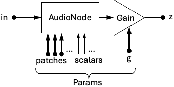

# MintueSynth Intro

As in the README...

This is a small-scale front-end for working with the WebAudio library found in modern web browsers. The motivation for creating this was to leverage the powerful features of WebAudio in a form that was more compact than WebAudio itself could offer. It was used by Neurolyte in a couple of 64K JavaScript demo projects. The pluggable design was helpful for tinkering with sounds at the barest minimum of overhead. The library's terseness helped in whipping up code quickly and estimating final code size. After minifying, it was remarkably small.

## Modules

MinuteSynth is comprised of a number of modules that have a common interface for snapping them together. This is the general pattern seen in modules:



Most modules are comprised of some kind of WebAudio AudioNode followed by a GainNode. Patches of upstream constants or audio streams may be made for the input and patchable parameters. There are sometimes other non-patchable parameters ("scalars") that are only set once upon module instanciation. Finally, the output can be patched in one or more places downstream.

The next section explains further.

## Semantics

Most of the modules follow these patterns:

* A module is created by calling a module name with a set of parameters:
  ```javascript
  // Create a sinewave with a fixed frequency of 600 Hz
  let myOscillator = M$.Osc({ t: M$.sine, f: 600 })
  ```
  * Some parameters may be patchable, optionally able to receive upstream modules (`f:` in the example can do this), while other parameters are preset scalars that never change (e.g. `t:`).
* Main audio patches between upstream and downstream modules can be made:
  * Forward patch: `.$()` method
  * Reverse patch `.r$()` method, and also `r$:` parameter upon instanciation.
  ```javascript
  source.$(destination) // <-- Forward patch
  destination.r$(source) // <-- Reverse patch

  // And, reverse-patch-upon-instanciation example:
  let filter = M$.Filt({ t: M$.lowpass, q: 10, f: 300, r$: source })
  ```
* There's often a built-in gain node that's controlled with the `g:` patchable parameter set to `1` by default:
  ```javascript
  // Approach #1: Set gain to a constant 1/2 upon instanciation:
  let myOscillator = M$.Osc({ t: M$.sine, f: 600, g: 1/2 })
  // Approach #2: Set once after instanciation:
  let myOscillator = M$.Osc({ t: M$.sine, f: 600 })
  myOscillator.g.r$(1/2)
  // Approach #3: Set at specific time using vC()... see further below:
  myOscillator.g.vC(1/2)
  ```
* Multiple patches are added together when an `[]` array is used:
  ```javascript
  let sinewave = M$.Osc({ t: M$.sine, f: 600 }),
      squarewave = M$.Osc({ t: M$.square, f: 400 })
  voice.r$([sinewave, squarewave])
  ```
* The `M$.Gain` module will multiply patches together:
  ```javascript
  let multResult = M$.Gain({ g: sinewave, r$: squarewave })
  voice.r$(multResult)
  ```
* Patchable parameters can take a constant scalar as an input, a module as an input, or an array. If you want to have a scalar in an array, you'll need to create a `M$.C` (Constant) module for it.
  ```javascript
  // Example 1: Set the gain to a constant scalar 1/2:
  let sinewave = M$.Osc({ t: M$.sine, f: 600, g: 1/2 })
  // Example 2: Set the gain to a 3 Hz sinewave:
  let sinewave = M$.Osc({ t: M$.sine, f: 600, g: M$.Osc({ t: M$.sine, f: 3 }) })
  // Example 3: both: adds 1/2 to the 3 Hz sinewave:
  let sinewave = M$.Osc({ t: M$.sine, f: 600,
                          g: [M$.Osc({ t: M$.sine, f: 3 }), M$.C(1/2)] })
  // Example 3b: Set the final gain to be positive by scaling the 3 Hz
  // sinewave to 1/2 and biasing by adding a constant 1/2 to that:
  let sinewave = M$.Osc({ t: M$.sine, f: 600,
                          g: [M$.Osc({t: M$.sine, f: 3, g: 1/2}), M$.C(1/2)] })
  // Example 3c: A clearer way to write that:
  let tremolo = M$.Osc({ t: M$.sine, f: 3, g: 1/2 })
  let sinewave = M$.Osc({ t: M$.sine, f: 600, g: [tremolo, M$.C(1/2)] })
  ```
* If patchable parameters already have modules set as inputs, then subsequent patches are added to those existing inputs:
  ```javascript
  let voltage = M$.C(1),
      sinewave = M$.Osc({ t: M$.sine, f: 100, g: 1/4 }),
      biasedGain = M$.Gain({ g: sinewave, r$: voltage })
  biasedGain.g.r$(M$.C(1/2));
  // biasedGain will now vary between 1/4 and 3/4.
  // Note also this would produce the same effect:
  biasedGain = M$.Gain({ g: [sinewave, M$.C(1/2)], r$: voltage });
  ```

Other esoteric details:

* The "type" parameter `.t` on Oscillators and Filters (`M$.Osc` and `M$.Filt`) can take a string literal for the corresponding AudioNode (e.g. `'sine'`), take the M$ convenience attribute (e.g. `M$.sine`), or be substituted with a number (e.g. `1`) that maps into a lookup table found in the MinuteSynth code. See the [Cheat Sheet](cheatsheet.md) for more info.
  ```javascript
  // String:
  let sinewave = M$.Osc({ t: 'sine', f: 100, g: 1/4 })
  // Convenience attribute:
  let sinewave = M$.Osc({ t: M$.sine, f: 100, g: 1/4 })
  // Shorthand number:
  let sinewave = M$.Osc({ t: 1, f: 100, g: 1/4 })
  ```
* The Distorter `M$.Dist` module takes an `a` parameter for "amount". It can range from -2.9 to 100 or beyond. Values below 0 map to an exponential curve where low audio values are quieted, and values above 0 map to a sigmoid where low audio values are amplified.
* A module's main audio output is usually emerging from a gain AudioNode that's accessible by the `.z` attribute if need be.
* If you want to route the output of a MinuteSynth module to a WebAudio node input, you can use the `connect()` method on the module's output:
  ```javascript
  // Let's say we have an "analyser" object from WebAudio.
  let myOscillator = M$.Osc({ t: M$.sine, f: 30 })
  myOscillator.z.connect(analyser)
  ```

## The Voice Module

The `M$.Voice` module is a special module that represents the connection to the final output, which by default is the web browser's sound output. A couple extra features allow for default frequency control (available through the `f` attribute), and triggering of modules on/off.

As a first example, the code snippet below would allow for a sound to be emitted indefinitely. Also, this would allow the voice's built-in frequency controller to control the oscillator.

```javascript
let voice = M$.Voice({ g: 1/4, f: 600 }) // Make the voice request 600 Hz at quarter-gain
let sinewave = M$.Osc({ t: M$.sine, f: voice.f }) // Patch the voice's freq. control to Osc
voice.r$(sinewave)
```

Next, if we wanted to delay the voice, we can utilize the current time record for the synthesizer and set events relative to that time.

```javascript
let now = M$.now()
voice.off(now)
voice.on(now + 1, 600) // Delay sound start in 1 second with freq. controller at 600 Hz
voice.off(now + 2) // Then shut it off 1 second after that
```

Any module that cares to respond to these on and off events (e.g. those that have `on()` and `off()` methods, including `M$.ADSR`) can be patched to Voice using `Voice.$()`.

## Time-Dependent Controls on Modules

### Start/Stop

Controlling sound on/off at the voice level may be crude. It may be advantageous to be able to control when individual oscillators start and stop. Let's look at this example:

```javascript
let voice = M$.Voice({ g: 1/4, f: 600 })
let osc1 = M$.Osc({ t: 1, f: voice.f, s: -1 })
let osc2 = M$.Osc({ t: 1, f: [voice.f, M$.C(-20)], s: -1 }) // Detune 20 Hz lower
voice.r$([osc1, osc2])
```

When we make the oscillators in this example, we set the "start time" `s:` parameter to `-1` which means "defer starting". We can then add in this fine-tuned control for switching the oscillators on and off:

```javascript
let now = M$.now()
osc1.s.go(now + 1)
osc1.s.no(now + 3)
osc2.s.go(now + 2)
osc2.s.no(now + 4)
```

This causes osc1 to go after a 1-second delay, osc2 to start a second after that, and for oscillators to stop 2 seconds later each.

Oscillators, Noise, and Buffer (`M$.Osc`, `M$.Noise`, and `M$.Buf`) all have a non-patchable scalar "start" parameter `s` that tells the respective AudioNode objects to start at specific times. If `s` is undefined, then the start happens immediately. If it is `-1`, then they won't start until the `.go()` method is called.

### ADSR Controls

It is also possible to linearly control the gain nodes that are bundled with each oscillator (or similarly control almost any parameter, for that matter). One model commonly used to change controls is "ADSR", or "Attack, Decay, Sustain, Release". The ADSR control has a series of scalar parameters, illustrated in this figure:


| Scalar | Meaning | Default |
|-|-|-|
| D | Start delay (sec) | 0 |
| b | Base value (value of "off") | 0 |
| e | Attack maximum value | 1 |
| a | Attack time (sec) | 1e-3 |
| d | Decay (time to go from e to s) | 0 |
| s | Sustain value | 1 |
| r | Release time (time to go from s to b when triggerOff) | 0 |
| p | Auto-pulse (if nonzero, time to automatically triggerOff) | 0 |

> **Trick:** It is possible to invert the ADSR curve by setting b > e or b > s.

The ADSR module is especially useful when it is patched to a Voice trigger output, as that controls when the curve begins and when it enters into the release phase. Such a patch can appear like this:

```javascript
const voice = M$.Voice()

// Approach 1: Second ADSR parameter
const adsr = M$.ADSR({ a: 0.5, d: 0.5, s: 0.7, r: 2 }, voice)

// ...or Approach 2: Voice forward special trigger patch:
voice.$(adsr)

// ...or Approach 3: Explicit rg() "register" method call on Voice:
voice.rg(adsr)

// Finish up, using the Voice's frequency generator attribute:
const osc = M$.Osc({ t: M$.square, f: voice.f, g: adsr })
osc.$(voice)

// Play a note:
voice.on(M$.now(), 600)
voice.off(M$.now() + 2)
```

### Lower Level Controls

The WebAudio value controls are also made available. This is an example of using:

```javascript
osc1.g.vT(1, now + 1)
osc1.g.lT(0, now + 3) // Linearly go from 1 to 0 in 2 sec.
osc2.g.vT(1, now + 2)
osc2.g.lT(0, now + 4) // Same
```

Controls include:

| Method(Params) | Description |
|-|-|
| `vC(value)` | Set constant value for all time |
| `vT(value, startTime)` | Set value at scheduled time |
| `lT(value, endTime)` | Linear ramp to value at end time |
| `eT(value, endTime)` | Exponental ramp to value at end time (0 is valid) |
| `t(value, startTime, tc)` | Start nonlinear glide to value using given time constant (e.g. 1/3 gets 95% toward value over 1 sec.) |
| `cv(values, startTime, dur)` | Calls WebAudio AudioParam setValueCurveAtTime() method
| `c(startTime)` | Cancels scheduled events after the given time |
| `h(holdTime)` | Cancels scheduled events after the given time, and holds the value constant at that time |
| `z0()` | Sets value to 0 |

These types of controls are available for most scalar parameters in MinuteSynth, including `M$.C` constants.
